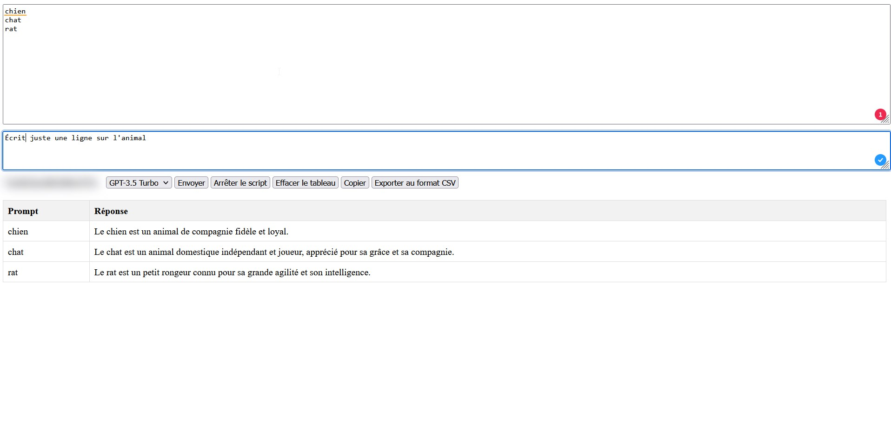

# chatgpt-bulk-web
Cet outil permet de lancer des commandes ChatGPT en masse et de récupérer le résultat dans un tableau exportable en CSV.

Lance le index.html et enjoy.

Vous pouvez le tester directement ici : 

Mes liens :

Chaine youtube : https://www.youtube.com/channel/UCNFED93Cb1U6-QnrVXZlBkw

Formation : https://devenirentrepreneurweb.fr/formations/
